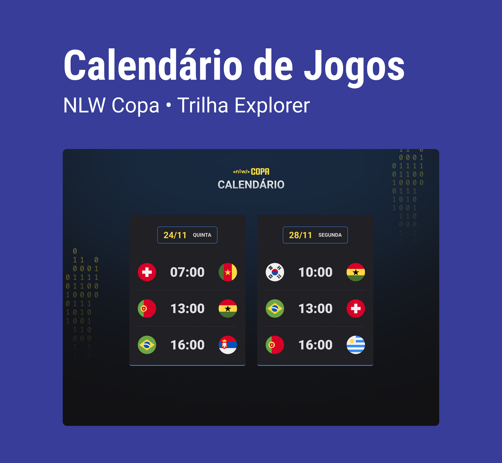

<h1 align="center"> NLW COPA </h1>

Evento exclusivo e gratuito, promovido pela Rocketseat para ensino  de tecnologias WEB.

    <a href="#-tecnologias">Tecnologias</a>&nbsp;&nbsp;&nbsp;|&nbsp;&nbsp;&nbsp;
    <a href="#-projeto">Projeto</a>&nbsp;&nbsp;&nbsp;|&nbsp;&nbsp;&nbsp;
    <a href="#-layout">Layout</a>&nbsp;&nbsp;&nbsp;|&nbsp;&nbsp;&nbsp;
    <a href="#-memo-licença">Licença</a>

    

 

    

 ## Tecnologias

 Esse projeto foi desenvolvido com as seguintes tecnologias:

 - HTML e CSS
 - Javascript
 - Git e Github

 ## 🚀 Projeto

 O Calendário da Copa é um projeto que mostra os jogos da copa de 2022.

 ## 📟 Layout

 Você pode visualizar o layout do projeto através [AQUI] (https://www.figma.com/file/J1Z33MISC22YZB8wfxiIns/NLW-Copa-Explorer/duplicate). É necessário ter conta no [Figma] (https://figma.com) para acessá-lo.

 ## 📲 Contato

Entre em contato comigo por e-mail ou pelo meu LinkedIn:

<h5 align="center">
  &copy;2022 - <a href="https://github.com/lucsvvieira/">Lucas Vieira</a>
</h5>

